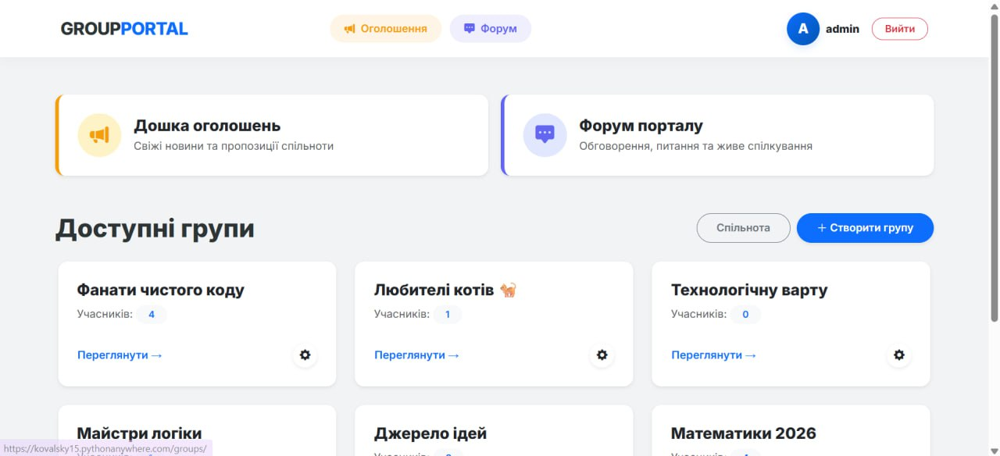
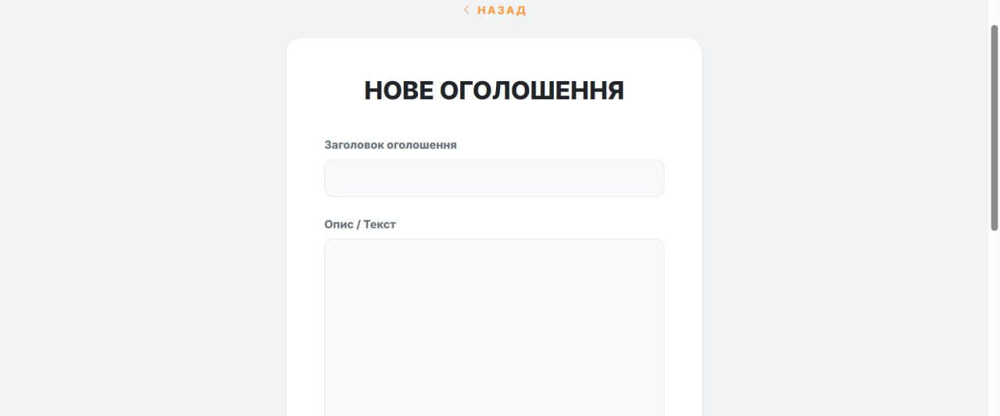
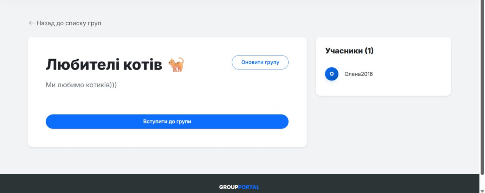

# GroupPortal

### Introduction
A community-focused web platform built with **Django** for managing groups and social interactions.

## 🛠 Tech Stack

### Features:
* **Join Groups:** Find and join communities of like-minded people.
* **Profile Customization:** Create an account, sign in, and personalize your profile.
* **Community Forum:** Communicate with others using a user-friendly forum.
* **Social Interaction:** Discuss hobbies and interests with friends.
* **Notifications:** Stay up to date with the latest community news.

### Screenshots

📸 View more screenshots

#### Creating Advertisement

#### Group Detail

---

## Installation Guide

### Quick Start
[Visit the live website here](https://kovalsky15.pythonanywhere.com/groups/)

### Local Setup (EN):
1. Download the project using the ZIP file from the latest **release** or clone the repository:  
   `git clone https://github.com/KovalskyDev/Group_Portal.git`
2. Open the project folder in your IDE.
3. Create a virtual environment: `python -m venv venv`
4. Activate it:
   * **Windows:** `.\venv\Scripts\activate`
   * **Linux/macOS:** `source venv/bin/activate`
5. Install **dependencies**: `pip install -r requirements.txt`
6. Run the server: `python manage.py runserver`

### Локальная установка (RU):
1. Загрузите проект через ZIP-архив (последний **релиз**) или клонируйте репозиторий:  
   `git clone https://github.com/KovalskyDev/Group_Portal.git`
2. Откройте папку в вашей IDE.
3. Создайте виртуальное окружение: `python -m venv venv`
4. Активируйте его:
   * **Windows:** `.\venv\Scripts\activate`
   * **Linux/macOS:** `source venv/bin/activate`
5. Установите зависимости: `pip install -r requirements.txt`
6. Запустите сервер: `python manage.py runserver`

## 👥 Team

| Role | Avatar | Name | Task |
| :--- | :--- | :--- | :--- |
| **Team Lead** |  | [KovalskyDev](https://github.com/KovalskyDev) | Architecture, Models, Code Review, CSS, UI |
| **Backend** |  | [Keth1o](https://github.com/Keth1o) | Views, Database logic |
